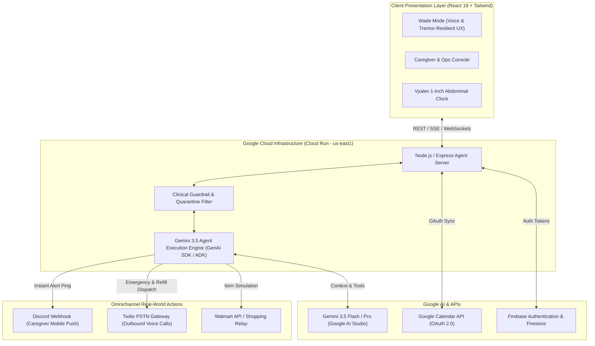

# 🌟 The Legacy Honored Companion
> **An Adaptive, Voice-Led Cognitive Co-Pilot & Multi-Agent Care Ecosystem for Parkinson's Independence**

[](https://the-legacy-honored-companion-53700756169.us-east1.run.app)
[](https://ai.google.dev/)
[](https://cloud.google.com/vertex-ai)
[](https://opensource.org/licenses/MIT)

---

## 🚀 Live Demo & Quick Links
- 🌐 **Live Hosted Web Application:** [https://the-legacy-honored-companion-53700756169.us-east1.run.app](https://the-legacy-honored-companion-53700756169.us-east1.run.app)
- 📹 **Demo Video (4 Min):** [YouTube / Demo Video Link](https://youtu.be/your-video-link-here)
- 📄 **Submission Category:** Collaborative Partner *(Sub-category fit: Taskmaster)*

---

## 📖 Table of Contents
1. [Overview & Problem Statement](#-overview--problem-statement)
2. [Key Features & Agent Capabilities](#-key-features--agent-capabilities)
3. [System Architecture](#-system-architecture)
4. [Technologies Used](#-technologies-used)
5. [Data Sources & Integrations](#-data-sources--integrations)
6. [Clinical Safety Guardrails](#-clinical-safety-guardrails)
7. [Findings & Learnings](#-findings--learnings)
8. [Spin-Up Instructions (Local & Cloud Run)](#-spin-up-instructions)
9. [Team & License](#-team--license)

---

## 🩺 Overview & Problem Statement

Individuals living with Parkinson's disease and their families face demanding daily challenges:
- **Strict Pharmacokinetics:** Levodopa absorption conflicts with dietary proteins, requiring calculated meal timing.
- **Continuous Infusion Maintenance:** 24-hour subcutaneous pumps (e.g., Vyalev) require strict 1-inch radial site rotations and immediate isolation of irritated tissue.
- **Cognitive & Motor Hurdles:** Tremors and speech volume changes make standard phone apps frustrating and inaccessible.
- **Caregiver Coordination Overhead:** Caregivers constantly juggle work travel, child routines, and patient appointments.

**The Legacy Honored Companion** solves this by pairing **Gemini 3.5** with real-time operational tools to serve as an autonomous, dignified, and proactive care partner for **Captain Wade** and his caregiver **Elsbeth**.

---

## 🎭 Key Features & Agent Capabilities

### 1. 🎙️ Wade Mode (Voice-First Patient UX)
- **Acoustic Earcon Feedback:** Audio cues for mic activation, confirmation, and error recovery.
- **Tremor-Resilient Touch Targets:** High-contrast, large-surface interactive buttons (120px+ touch targets).
- **Daily Audio Briefings:** Proactive synthesized morning briefings covering schedule, weather, and pump telemetry.
- **1-Tap Quick Favorites:** Instant voice or button request simulation for hydration, comfort items, and Walmart ordering.
- **Direct Caregiver Reach:** 1-touch priority dispatch to alert Elsbeth immediately.

### 2. 🧪 Autonomous Vyalev Infusion Site Rotation Agent
- **1-Inch Periumbilical Placement Map:** Circular 8-slot abdominal clock (12:00, 1:30, 3:00, 4:30, 6:00, 7:30, 9:00, 10:30).
- **Zero Redness Re-Use Quarantine:** Automatically quarantines any clock position exhibiting erythema or tape sensitivity until dermal tissue is 100% healed.
- **Under-Belly & Belt Line Exclusion:** Automatically excludes lower quadrants (4:30, 6:00, 7:30) to eliminate waistband friction and skin breakdown.
- **Telemetry Checklist:** Logs dwell time, erythema severity, tenderness, edema, nodules, and cannula seal integrity.

### 3. 📅 Smart Google Calendar Context Engine
- **Algorithmic Care Event Tagging:** Real-time OAuth 2.0 Google Calendar ingestion (`calendar.readonly` / `calendar.events`).
- **Autonomous Mobility Buffering:** Automatically calculates and injects a **+25-minute mobility buffer** for transit to clinic appointments and PT sessions.
- **Audience & Location Separation:** Intelligently distinguishes caregiver travel (Elsbeth in LA), youth family events (Little Wade soccer), and patient clinical consultations.

### 4. 📲 Omnichannel Alerting & Real PSTN Telephony Gateway
- **Sub-Second Discord Webhook Push:** Dispatches rich status embeds and critical push notifications directly to the caregiver's mobile phone.
- **Twilio PSTN Outbound Voice Gateway:** Executes real cellular phone calls with neural voice audio for emergency escalation and specialty pharmacy Vyalev 24h pump refill authorization.

### 5. 📊 Neurologist Synthesis (Dr. Henderson Dossier)
- Single-click automated generation of weekly motor ON/OFF logs, infusion site reactions, and MDS-UPDRS telemetry for telehealth consultations.

---

## 🏗️ System Architecture



---

## 💻 Technologies Used

| Layer | Technology | Purpose |
|---|---|---|
| **AI / Core Models** | **Gemini 3.5 Flash & Pro (Google AI Studio)** | Natural language reasoning, schedule parsing, tool calling, and clinical synthesis |
| **Agent Framework** | **Google GenAI SDK / Agent Development Kit (ADK)** | Multi-turn memory, tool orchestration, and background execution |
| **Cloud Hosting** | **Google Cloud Run (`us-east1`)** | Fully managed containerized microservice runtime |
| **Identity & Security** | **Firebase Authentication & Google OAuth 2.0** | Secure user login, session management, and Google Calendar scopes |
| **Frontend Framework** | **React 19, TypeScript, Vite, Tailwind CSS** | High-performance, low-latency, accessible UI |
| **Telephony Gateway** | **Twilio Voice API & Neural Voice** | Direct cellular PSTN phone calls for emergency dispatch & pharmacy refills |
| **Notifications** | **Discord REST Webhooks** | Real-time mobile push notifications to caregivers |
| **Icons & Media** | **Lucide Icons & Web Audio API** | Accessible visual cues and low-latency acoustic earcons |

---

## 📊 Data Sources & Integrations

1. **Google Calendar API (`v3`):** Primary care calendar synchronization, attendee resolution, and dynamic transit scheduling.
2. **Vyalev Pharmacokinetic Protocol:** Continuous subcutaneous levodopa delivery guidelines, needle change timing, and infusion site management.
3. **MDS-UPDRS Parkinson's Scoring Rubric:** Clinical data modeling for motor fluctuations and neurologist reporting.
4. **Discord Webhook API:** Mobile notification pipeline.
5. **Twilio Programmable Voice:** Real PSTN outbound telephony carrier gateway.

---

## 🛡️ Clinical Safety Guardrails

- **Zero Redness Re-Use:** Sites logged with erythema are immediately placed in quarantined state and excluded from future rotation suggestions until fully clear.
- **Belt Friction Exclusion:** Prevents cannula placement along lower abdominal quadrants (4:30, 6:00, 7:30) to eliminate pressure necrosis and waistband dislodgement.
- **Levodopa Meal Isolation:** Recommends low-protein morning meals to prevent Large Neutral Amino Acid (LNAA) carrier competition across the blood-brain barrier, scheduling protein repletion during evening rest windows.

---

## 💡 Findings & Learnings

- **Auditory Cues Trump Visual Notifications for Tremors:** Immediate acoustic feedback (earcons) confirmed input success without requiring the patient to steady their gaze or hand.
- **Agentic Buffer Scheduling Prevents Motor Freezing:** Parkinson's motor freezing episodes spike during time pressure. Proactively scheduling **+25-minute buffers** prior to transit drastically reduces anxiety and physical freezing risks.
- **Multimodal AI Bridges Generation Gaps:** Gemini 3.5's reasoning seamlessly synthesized high-level caregiver plans into clear, single-step directives suited for cognitive ease.

---

## 🚀 Spin-Up Instructions

### Prerequisites
- **Node.js**: v18.0.0 or higher
- **npm** or **yarn**
- **Google AI Studio API Key** (Gemini 3.5)
- **Google Cloud Platform Account** (with Cloud Run enabled)

### Local Setup

1. **Clone the repository:**
   ```bash
   git clone https://github.com/Sprinkels95/The-Legacy-Honored-Companion.git
   cd The-Legacy-Honored-Companion
   ```

2. **Install dependencies:**
   ```bash
   npm install
   ```

3. **Configure Environment Variables:**
   Create a `.env` file in the root directory:
   ```env
   # Google Gemini & AI Studio
   VITE_GEMINI_API_KEY=your_gemini_api_key_here
   GEMINI_MODEL=gemini-3.5-flash

   # Google Firebase & Cloud
   VITE_FIREBASE_API_KEY=your_firebase_api_key
   VITE_FIREBASE_AUTH_DOMAIN=memory-lane-app-469523.firebaseapp.com
   VITE_FIREBASE_PROJECT_ID=memory-lane-app-469523

   # Telephony & Alerts (Optional)
   DISCORD_WEBHOOK_URL=your_discord_webhook_url
   TWILIO_ACCOUNT_SID=your_twilio_sid
   TWILIO_AUTH_TOKEN=your_twilio_token
   TWILIO_PHONE_NUMBER=your_twilio_phone
   ```

4. **Run the development server:**
   ```bash
   npm run dev
   ```
   Open your browser at `http://localhost:5173`.

---

### Cloud Deployment (Google Cloud Run)

1. **Build and submit container image via Google Cloud Build:**
   ```bash
   gcloud builds submit --tag gcr.io/memory-lane-app-469523/the-legacy-honored-companion
   ```

2. **Deploy to Cloud Run:**
   ```bash
   gcloud run deploy the-legacy-honored-companion \
     --image gcr.io/memory-lane-app-469523/the-legacy-honored-companion \
     --platform managed \
     --region us-east1 \
     --allow-unauthenticated
   ```

3. **Verify Live Service:**
   Access your deployed Cloud Run URL:
   `https://the-legacy-honored-companion-53700756169.us-east1.run.app`

---

## 👥 Team & Acknowledgments

- **Lead Developer & Creator:** Sprinkels (`@Sprinkels95`)
- **Inspired by:** Captain Wade & caregivers worldwide managing Parkinson's disease.
- **Built for:** The `#AllThingsAgentic` Google Gemini Hackathon.

---

## 📝 License
This project is licensed under the MIT License - see the [LICENSE](LICENSE) file for details.
