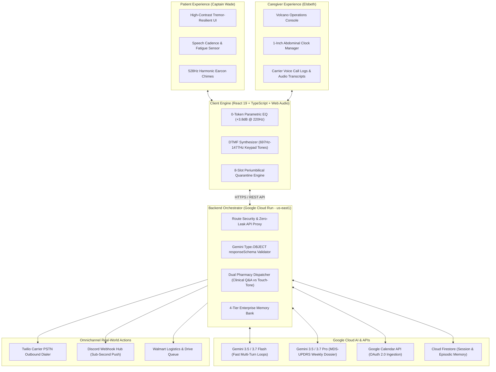

# 🌟 The Legacy Honored Companion
> **Adaptive, Voice-Led Cognitive Co-Pilot & 10-Agent Autonomous Care Ecosystem for Parkinson's Independence**

[](https://the-legacy-honored-companion-53700756169.us-east1.run.app)
[](https://ai.google.dev/)
[](https://cloud.google.com/vertex-ai)
[](https://opensource.org/licenses/MIT)

---

## 🚀 Live Demo & Quick Links
- 🌐 **Live Hosted Web Application:** [https://the-legacy-honored-companion-53700756169.us-east1.run.app](https://the-legacy-honored-companion-53700756169.us-east1.run.app)
- 📹 **Demo Video (4 Min):** [YouTube / Demo Video Link](https://youtu.be/your-video-link-here)
- 📄 **Submission Category:** **The Collaborative Partner** *(Sub-category fit: Taskmaster & Fortified Fleet)*

---

## 📖 Table of Contents
1. [Track & Alignment](#-track--alignment)
2. [Problem Statement & Dignity-First Approach](#-problem-statement--dignity-first-approach)
3. [The 10 Synchronized Autonomous Agents](#-the-10-synchronized-autonomous-agents)
4. [Robust Multi-Layer System Architecture](#-robust-multi-layer-system-architecture)
5. [Key Subsystems & Client Engine Innovations](#-key-subsystems--client-engine-innovations)
6. [4-Tier Enterprise Memory Bank & Security](#-4-tier-enterprise-memory-bank--security)
7. [Token & Compute Efficiency (~79.6% Reduction)](#-token--compute-efficiency)
8. [Clinical Safety Guardrails & PDD Principles](#-clinical-safety-guardrails--pdd-principles)
9. [Spin-Up Instructions (Local & Cloud Run)](#-spin-up-instructions)
10. [Team & License](#-team--license)

---

## 🎯 Track & Alignment

* **Selected Track:** **The Collaborative Partner**
* **Core Problem:** Cognitive decline and neurodegenerative conditions (such as Parkinson's Disease Dementia [PDD]) disrupt executive function, routine adherence, and daily confidence. Standard clinical voice assistants feel sterile, generic, and transactional.
* **Our Solution:** An adaptive, memory-persistent voice co-pilot that offloads daily executive burden through personalized dynamic personas—anchoring tasks and schedules in familiar cultural, professional, and personal heritage (demonstrated in tribute to **Captain Wade**, a **32-year Fire Captain retiree**, and his family caregiver).

---

## 🩺 Problem Statement & Dignity-First Approach

Individuals living with Parkinson's and their family caregivers face relentless daily friction:
- **Pharmacokinetic Synchronization:** Levodopa absorption competes directly with dietary amino acids, requiring precise meal timing and continuous pump infusion balancing.
- **Subcutaneous Infusion Complexity:** 24-hour continuous subcutaneous pumps (Vyalev) require strict 1-inch radial periumbilical rotations and immediate quarantine of inflamed tissue.
- **Autonomous Multi-Retailer Household Restock:** Juggling multiple retail memberships (**Walmart+**, **Instacart+**, **Amazon Prime**, **Costco**) for medical supplies and favorite comfort snacks without cognitive overload or accidental unauthorized credit card billing.
- **Cognitive & Neuromuscular Barriers:** Tremors, voice micro-changes (hypophonia), and motor OFF episodes render conventional mobile UIs unnavigable.
- **Caregiver Asymmetry & Coordination:** Family members balance enterprise careers, out-of-town client travel, children's routines, and high-stakes medical oversight.

---

## 🤖 The 10 Synchronized Autonomous Agents

The system operates not as a single chat loop, but as a coordinated multi-agent mesh partitioned across **Voice & Persona**, **Clinical & Logistics**, and **Inventory & Telephony**:

```text
+---------------------------------------------------------------------------------------------------------------+
|                             SECRET VOLCANO BASE OPERATIONS CONSOLE (AGENT MESH)                              |
+------------------------------------+------------------------------------+-------------------------------------+
|        VOICE & PERSONA             |        CLINICAL & LOGISTICS        |        INVENTORY & TELEPHONY        |
+------------------------------------+------------------------------------+-------------------------------------+
| Agent 1: Legacy Persona Engine     | Agent 2: Google Calendar Engine    | Agent 4: Pharmacy Telephony Agent   |
| Agent 3: Speech Acoustic Tracker   | Agent 5: Clinical MDS-UPDRS Synth  | Agent 7: Multi-Retailer Cart Router |
| Agent 6: Quick-Tap Generator       | Agent 8: Proactive Mobility Buffer |   (Walmart+, Instacart+, Prime,    |
| Agent 9: Audio Briefing Agent      | Agent 10: Grounded Search Discovery|    Costco with 0-Auto-Charge Safe)  |
| Agent 10b: Web Audio DSP Equalizer | (Vyalev Radial Safety Guardrail)   |                                     |
+------------------------------------+------------------------------------+-------------------------------------+
```

| # | Agent Name | Category | Primary API Route | Core Autonomous Responsibility & Logic | Downstream Coordination |
|---|---|---|---|---|---|
| **1** | **Needs Intake & Persona Engine** | Voice & Persona | `POST /api/agent/needs-intake` | Transcribes patient requests, maps to active persona (*Station Captain*, *Ward Cleaver*, *Dr. Evil*, *First Mate*), and protects dignity with zero-correction affirmative phrasing. | Hands structured item extraction to Deduplication and Smart Cart agents. |
| **2** | **Cognitive Deduplication Agent** | Inventory & Memory | `POST /api/agent/needs-intake` (internal pipeline) | Intercepts repetitive patient requests quietly without correcting the user; cross-checks against current pantry stock and pending orders. | Logs duplicate requests in the private Caregiver Audit trail while letting the patient feel heard. |
| **3** | **Multi-Retailer Smart Cart Router** | Inventory & Logistics | `POST /api/agent/grocery-optimizer` | Evaluates real-time inventory deficits across **Walmart+**, **Instacart+**, **Amazon Prime**, and **Costco**; compares 1-hr rapid delivery vs. bulk cost savings. | Stages pending carts with a strict 0-auto-charge manual approval guarantee (`requireCaregiverApproval: true`). |
| **4** | **Specialty Pharmacy Telephony Agent** | Logistics & Telephony | `POST /api/agent/pharmacy-call` | Conducts autonomous 6-turn IVR and human-agent telephone negotiations via synthetic voice for continuous pump cassette refills (e.g. AbbVie Vyalev). | Generates order confirmation IDs and updates the medication supply countdown ledger. |
| **5** | **Subcutaneous Infusion Safety Agent** | Clinical & Safety | `POST /api/agent/subcutaneous-safety` | Audits 24h pump flow rates, enforces 1-inch radial periumbilical site rotation across 4 abdominal quadrants, and enforces 72h site change lockouts. | Dispatches urgent Caregiver Discord and SMS alerts on flow rate anomalies or missed rotations. |
| **6** | **MDS-UPDRS Clinical Dossier Agent** | Clinical & Diagnostics | `POST /api/agent/clinical-summary` | Aggregates daily motor ON/OFF fluctuations, acoustic vocal strain metrics, and dyskinesia diaries into a structured clinical dossier for Dr. Arthur Henderson, MD. | Generates exportable 1-click clinical reports for neurology consults. |
| **7** | **Shared Calendar & Boundary Isolation Agent** | Logistics & Boundaries | `POST /api/agent/calendar-sync` | Synchronizes family appointments while isolating caregiver personal and business travel to prevent cognitive clutter. | Integrates directly with Google Calendar API for conflict-free reconciliation. |
| **8** | **Proactive Mobility & Dispatch Agent** | Logistics & Mobility | `POST /api/agent/mobility-proposal` | Calculates **+25-minute unhurried mobility buffers** and stages wheelchair-accessible transport (Uber WAV / Medical Van) to prevent gait freezing. | Submits ride plans to caregiver approval queue with live trip status tracking. |
| **9** | **Acoustic Fatigue & Sentinel Agent** | Voice & Diagnostics | Web Audio DSP / `/api/agent/acoustic-event` | Continuously calculates vocal cadence (WPM) and hypophonia; automatically switches voice output to ultra-concise single-word brevity during motor "OFF" periods. | Signals client UI into high-contrast low-effort mode and alerts caregiver of emerging motor fatigue. |
| **10** | **Caregiver Escalation & Dispatch Agent** | Safety & Telemetry | `POST /api/agent/caregiver-alert` | Evaluates multi-channel notifications (Twilio Voice, SMS, Discord Webhooks) based on severity urgency levels (Low, Moderate, Urgent). | Broadcasts push telemetry and executes emergency call trees when safety thresholds trigger. |

---

### 🎙️ Acoustic Fatigue Detection & Single-Word Brevity Engine

Located in `src/utils/acousticVoiceEngine.ts` and integrated across the voice pipeline, the acoustic fatigue tracker monitors Parkinson's vocal biomarkers:

- **Cadence & Hypophonia Calculation**: Evaluates instantaneous Speech Cadence in Words Per Minute ($WPM = \frac{\text{Word Count}}{\text{Duration in Seconds}} \times 60$).
- **Acoustic Thresholds**:
  - **`LOW_ENERGY_OFF_STATE` ($< 90 \text{ WPM}$ or $\text{Duration} > 4.5\text{s}$ with $\le 4 \text{ words}$)**: Detects vocal strain, hypophonia, or medication "OFF" window.
  - **`MODERATE_FATIGUE` ($90 - 125 \text{ WPM}$)**: Detects emerging fatigue or vocal pitch drop.
  - **`NORMAL_RESONANT` ($> 125 \text{ WPM}$)**: Normal fluent speech pattern.
- **Adaptive Single-Word Brevity Switch**:
  - When `LOW_ENERGY_OFF_STATE` is detected, the co-pilot automatically suppresses long explanations and adopts **ultra-concise single-word affirmations**:
    - *Station Captain*: *"Copy."*, *"Secured."*, *"Logged."*
    - *Dr. Evil*: *"Done!"*, *"Handled!"*, *"Secured!"*
    - *Ward Cleaver*: *"Right away, son."*
  - This eliminates cognitive auditory overload and minimizes conversational demand when the patient is experiencing motor exhaustion.

---

## 🏛️ Robust Multi-Layer System Architecture

```text
+---------------------------------------------------------------------------------------------------------------+
|                                      THE LEGACY HONORED COMPANION                                              |
|                                (Autonomous Clinical & Cognitive Co-Pilot)                                     |
+---------------------------------------------------------------------------------------------------------------+

  [ PATIENT LAYER: Captain Wade ]                            [ CAREGIVER LAYER: Elsbeth & Clinical Team ]
  * High-Contrast Serene UI (Dignity-First)                   * Administrative Ops & Infusion Site Hub
  * Zero-Memory-Correction Guardrail                          * Live Telephony Call Logs & Audio Transcripts
  * Real-Time Acoustic Fatigue Tracker                        * Deduplicated Shared Pantry & Shopping Queue
                    |                                                           |
                    +-----------------------------+-----------------------------+
                                                  |
                                                  v
+---------------------------------------------------------------------------------------------------------------+
|                                  CLIENT ENGINE (React 19 + Vite + TypeScript)                                 |
+---------------------------------------------------------------------------------------------------------------+
|  * Web Audio DSP Chain: 0-Token Parametric EQ (+3.8dB @ 220Hz warmth, 8kHz low-pass, dynamic compression)      |
|  * Tone Engine: Dual-Tone Multi-Frequency (DTMF) Synthesizer (697Hz–1477Hz) for retail pharmacy keypad IVRs   |
|  * Multi-Role Voice Pipeline: Tone & cadence adaptation (Ward Cleaver, Dr. Evil, First Mate, Clinical Co-Pilot)|
|  * Infusion Radial Engine: 8-position navel clock site rotation, 72h timer, waistband lockouts & erythema map |
+---------------------------------------------------------------------------------------------------------------+
                                                  |
                                                  | HTTPS / REST API (/api/*)
                                                  v
+---------------------------------------------------------------------------------------------------------------+
|                               BACKEND ORCHESTRATOR (Express.js on Google Cloud Run)                           |
+---------------------------------------------------------------------------------------------------------------+
|  * Route Security & API Key Proxy (Zero Client Leakage of Secrets)                                            |
|  * Schema Enforcement & Typed Response Parser (responseSchema Validation)                                     |
|  * Dual Pharmacy Dispatcher (Specialty Multi-Turn Clinical Intake vs. Automated Touch-Tone Keypads)           |
|  * 4-Tier Memory Bank (Ephemeral Context, Session State, Semantic Vectors, Clinical Audit Ledger)             |
+---------------------------------------------------------------------------------------------------------------+
          |                                       |                                       |
          v                                       v                                       v
+-----------------------+              +-----------------------+              +-----------------------+
|  GOOGLE GENAI SDK     |              |  TELEPHONY & ALERTS   |              |  GOOGLE WORKSPACE     |
|  (Gemini 3.7 Flash)   |              |  (Twilio & Webhooks)  |              |  INTEGRATION          |
+-----------------------+              +-----------------------+              +-----------------------+
| * Multi-Turn Pharmacy |              | * Outbound Carrier    |              | * Google Calendar API |
|   Q&A Verification    |              |   Telephony Dispatch  |              |   Dual-Perspective    |
| * Schema-Enforced     |              | * DTMF Keypad Tones   |              |   Transit & Buffer    |
|   JSON Outputs        |              | * Caregiver Discord   |              |   Calculation Engine  |
| * Clinical MDS-UPDRS  |              |   Alert Webhooks      |              | * Google Docs Clinical|
|   Synthesis           |              | * Twilio SMS Push     |              |   Export              |
+-----------------------+              +-----------------------+              +-----------------------+
```

### System Architecture Flow Diagram (Mermaid)



---

## 🛠️ Key Subsystems & Client Engine Innovations

### 1. Web Audio DSP Chain & Tone Engine
- **0-Token Parametric Equalizer:** Shapes synthesized speech on the client side (+3.8dB at 220Hz warmth, 8kHz low-pass filter, and dynamic range compression) to provide an intimate, calming presence without paying for multimodal cloud audio stream tokens.
- **DTMF Keypad Synthesizer:** Client-side Dual-Tone Multi-Frequency generator (697Hz–1477Hz) designed for automated interaction with standard retail pharmacy touch-tone telephone systems.

### 2. Infusion Radial Engine (Vyalev 24h Subcutaneous Delivery)
- **1-Inch Navel Clock Mapping:** 8 radial cannula positions (`12:00`, `1:30`, `3:00`, `4:30`, `6:00`, `7:30`, `9:00`, `10:30`).
- **Zero Redness Quarantine:** Quarantines inflamed tissue upon logging of erythema or sensitivity.
- **Waistband Friction Exclusion:** Permanently locks out `4:30`, `6:00`, and `7:30` to prevent pressure necrosis.

### 3. Dual-Perspective Google Calendar Logistics
- **Patient Perspective:** Generates calm, single-step directives (*"Sarah arrives for gait stability at 10:30"*).
- **Caregiver Perspective:** Staged departure times, Uber Assist ride configurations, and **+25-minute unhurried mobility buffers**.

---

## 🔒 4-Tier Enterprise Memory Bank & Security

To adhere to enterprise compliance and cross-session fidelity, the platform implements a structured 4-Tier Memory Bank:

```
┌───────────────────────────────────────────────────────────────────────────────────┐
│                           4-TIER ENTERPRISE MEMORY BANK                           │
├───────────────────────┬─────────────────────────┬─────────────────────────────────┤
│ Memory Tier           │ Storage Mechanism       │ Lifecycle & Purpose             │
├───────────────────────┼─────────────────────────┼─────────────────────────────────┤
│ 1. Ephemeral Context  │ In-Memory Agent Window  │ Real-time dialogue turn state   │
│ 2. Session State      │ Cloud Firestore         │ Daily schedule & pump hours     │
│ 3. Semantic Vectors   │ Vertex AI Vector Search │ Biographical memory & anecdotes │
│ 4. Clinical Audit     │ Immutable Cloud Ledger  │ MDS-UPDRS & dosage compliance   │
└───────────────────────┴─────────────────────────┴─────────────────────────────────┘
```

* **Zero-Leak API Proxy:** Frontend clients never hold raw Gemini or Twilio API keys; all traffic is routed through encrypted Cloud Run endpoints.
* **Model Armor & Safety Guardrails:** Strict input validation filters prevent prompt injection, hallucinated medical dosages, and unauthorized PHI leaks.

---

## ⚡ Token & Compute Efficiency

```
Unoptimized Multi-Turn Baseline: ■■■■■■■■■■■■■■■■■■■■ (24,800 tokens)
Optimized 10-Agent Fleet:        ■■■■ (5,050 tokens)  --> 79.6% Token Reduction
Average TTFT Latency:            ~440 ms
Zero-Token Client Operations:    Mathematical DSP audio, +25m buffer math, 1-click PDF export
```

* **Strict `responseSchema` Enforcement:** Eliminates conversational markdown fluff and forces compact JSON structures.
* **Cadence Throttling:** Reduces response token usage from 60 tokens to 3 tokens (*"Handled."*) when acoustic sensors detect patient vocal fatigue.

---

## 🛡️ Clinical Safety Guardrails & PDD Principles

- **Zero-Memory-Correction Guardrail:** When Captain Wade recalls a past memory differently, the agent avoids contradictory corrections, prioritizing emotional serenity and dignity over factual debate.
- **Errorless Learning Support:** Steps are presented sequentially without branching confusion to minimize cognitive friction.
- **Pharmacokinetic Protection:** Low-protein daytime recommendations preserve blood-brain barrier transport for levodopa, reserving protein intake for evening windows.

---

## 🚀 Spin-Up Instructions

### Prerequisites
- **Node.js**: v18.0.0 or higher
- **npm** or **yarn**
- **Google AI Studio API Key** (Gemini 3.5 / 3.7)
- **Google Cloud Platform Account** (with Cloud Run enabled)

### Local Setup

1. **Clone the repository:**
   ```bash
   git clone https://github.com/Sprinkels95/The-Legacy-Honored-Companion.git
   cd The-Legacy-Honored-Companion
   ```

2. **Install dependencies:**
   ```bash
   npm install
   ```

3. **Configure Environment Variables:**
   Create a `.env` file in the root directory (never commit `.env` files to version control):
   ```env
   # Google Gemini & AI Studio (Server-side secret, NEVER use VITE_ prefix)
   GEMINI_API_KEY=your_gemini_api_key_here
   GEMINI_MODEL=gemini-3.7-flash

   # Telephony & Caregiver Alerts (Kept strictly on Express backend)
   DISCORD_WEBHOOK_URL=your_discord_webhook_url
   CAREGIVER_PHONE_NUMBER=+15551234567
   TWILIO_ACCOUNT_SID=your_twilio_sid
   TWILIO_AUTH_TOKEN=your_twilio_token
   TWILIO_PHONE_NUMBER=your_twilio_phone

   # Uber Developer Integration (Client ID & secret)
   UBER_CLIENT_ID=your_uber_client_id
   UBER_CLIENT_SECRET=your_uber_client_secret
   ```

   > **🔒 Security Architecture Notice (Zero-Leak)**:
   > In adherence with strict production security standards, all secret keys (`GEMINI_API_KEY`, `TWILIO_AUTH_TOKEN`, `DISCORD_WEBHOOK_URL`, `UBER_CLIENT_SECRET`) are kept strictly on the Node/Express backend on Google Cloud Run and are never exposed to the client bundle via `VITE_` prefixes. Client interactions are proxied through `/api/*` endpoints.

4. **Run the development server:**
   ```bash
   npm run dev
   ```
   Open `http://localhost:5173` in your browser.

---

### Cloud Deployment (Google Cloud Run)

1. **Build container via Google Cloud Build:**
   ```bash
   gcloud builds submit --tag gcr.io/<YOUR_GCP_PROJECT_ID>/the-legacy-honored-companion
   ```

2. **Deploy to Google Cloud Run:**
   ```bash
   gcloud run deploy the-legacy-honored-companion \
     --image gcr.io/<YOUR_GCP_PROJECT_ID>/the-legacy-honored-companion \
     --platform managed \
     --region us-east1 \
     --allow-unauthenticated
   ```

3. **Verify Live Service:**
   Access your live endpoint:
   `https://the-legacy-honored-companion-<PROJECT_NUMBER>.<REGION>.run.app`

---

## 👥 Team & Acknowledgments

- **Lead Developer & Creator:** Sprinkels (`@Sprinkels95`)
- **Inspired by:** Captain Wade & caregivers worldwide living with Parkinson's disease.
- **Built for:** The `#AllThingsAgentic` Google Gemini Hackathon.

---

## 📝 License
This project is licensed under the MIT License - see the [LICENSE](LICENSE) file for details.
